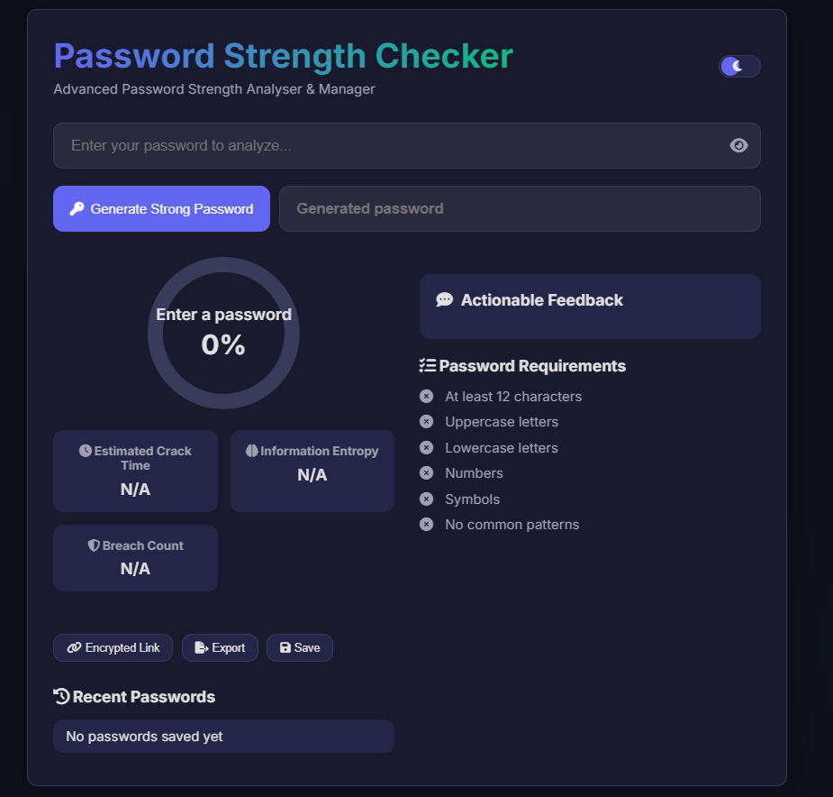
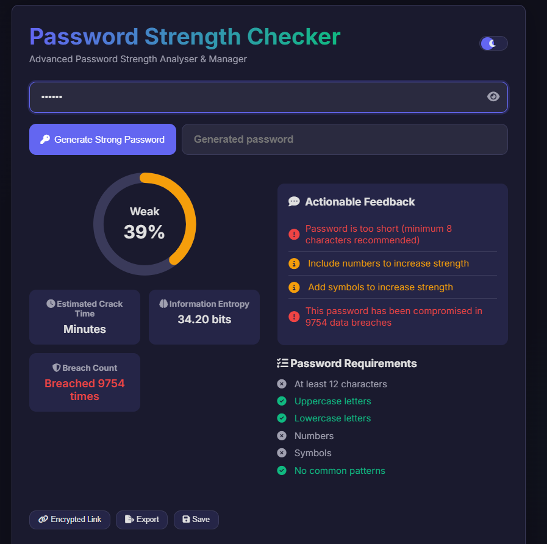
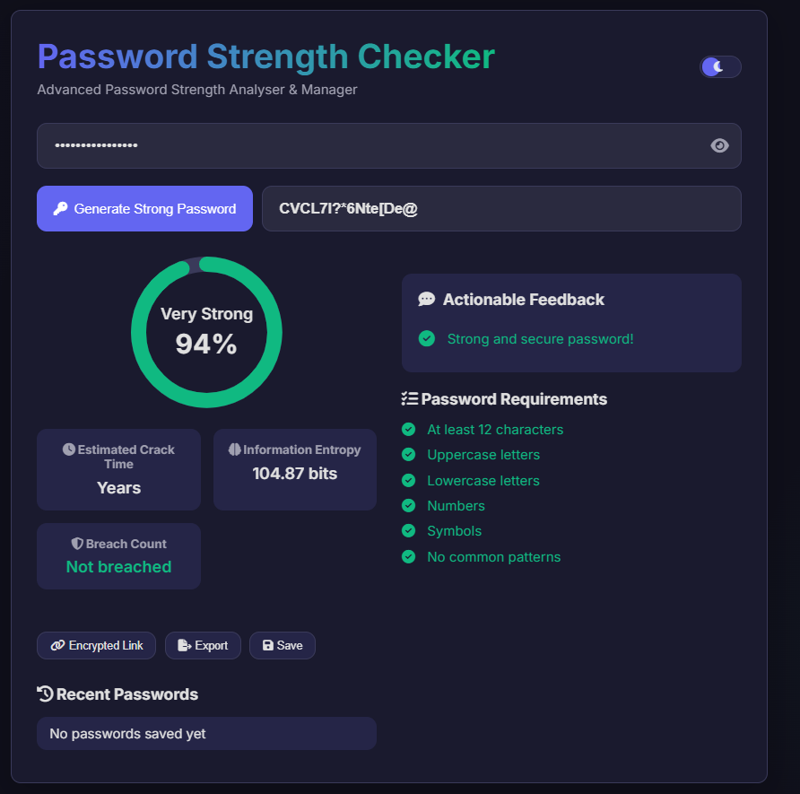
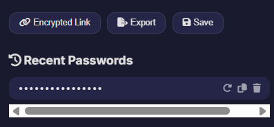

Absolutely! Here’s your **Project Aether README** rewritten to the same **portfolio-ready, professional standard** as your other projects, with badges, clean layout, screenshots table, features, project structure, and all sections polished:

---

# 🛡️ Project Aether – Advanced Password Strength Analyzer & Manager


**Project Aether** is a **privacy-focused, interactive web application** for analyzing, generating, and managing passwords. It provides real-time strength feedback, actionable security advice, breach detection, and tools to help users create and maintain secure passwords.

---

## 📑 Table of Contents

* [Live Demo](#-live-demo)
* [Screenshots](#-screenshots)
* [Key Features](#-key-features)
* [Project Structure](#-project-structure)
* [Getting Started](#-getting-started)
* [Technologies Used](#-technologies-used)
* [Security & Privacy](#-security--privacy)
* [Future Enhancements](#-future-enhancements)
* [Contributing](#-contributing)
* [Licence](#-licence)
* [Credits & Contact](#-credits--contact)

---

## 🌐 Live Demo

🔗 **[Try Project Aether](https://yourusername.github.io/project-aether/)**

---

## 📸 Screenshots

| Dashboard Overview                                     | Password Strength Analysis                           | Password Generator                                     | Password History & Management                      |
| ------------------------------------------------------ | ---------------------------------------------------- | ------------------------------------------------------ | -------------------------------------------------- |
|  |  |  |  |

**Suggested filenames for `assets` folder:**

* `screenshot-dashboard.png`
* `screenshot-analysis.png`
* `screenshot-generator.png`
* `screenshot-history.png`

Project path example:

```
C:\Users\sanil\Projects\Project-Aether\assets
```

---

## ✨ Key Features

### 🔒 Password Strength Analysis

* Real-time feedback with visual strength meter
* Detailed stats: estimated crack time, entropy, breach count
* Actionable suggestions to improve passwords
* Requirements checklist for length, complexity, and uniqueness

### 🧠 Advanced Security Checks

* Breach detection via [Have I Been Pwned](https://haveibeenpwned.com/) API
* Common pattern detection and repeated character alerts
* Entropy calculation for password randomness

### 🛠️ Password Generator

* One-click generation of strong, random passwords
* Clipboard copy and save to history

### 📋 Password History & Management

* View, copy, reuse, or delete last 5 saved passwords
* Local storage ensures passwords never leave the browser

### 🌗 Light/Dark Theme

* Switch between light and dark UI themes

### 📤 Export & Share

* Export password analysis as text
* Share passwords as encoded links (demo purposes only)

---

## 📂 Project Structure

```text
.
├── index.html           # Main dashboard UI
├── tailwind.css         # Styling via CDN
├── assets/              # Screenshots and UI assets
│   ├── screenshot-dashboard.png
│   ├── screenshot-analysis.png
│   ├── screenshot-generator.png
│   ├── screenshot-history.png
├── scripts/             # Optional JS scripts
└── README.md            # Project documentation
```

---

## 🚀 Getting Started

### 1. Clone the repository

```bash
git clone https://github.com/your-username/project-aether.git
cd project-aether
```

### 2. Open in browser

```bash
index.html
```

💡 For best results, use a **live server** in your code editor.

---

## 🛠️ Technologies Used

* **HTML5 & CSS3** – Modern, responsive UI
* **Vanilla JavaScript (ES6+)** – Real-time analysis and generation logic
* **Tailwind CSS** – Utility-first styling framework
* **Font Awesome** – Iconography for visual feedback
* **Google Fonts (Inter)** – Clean, readable typography
* **Have I Been Pwned API** – Password breach detection

---

## 🔐 Security & Privacy

* **All password analysis runs locally**; nothing is sent to a server
* **Breach detection** uses k-Anonymity: only partial SHA-1 hash is sent
* **Password history** stored securely in browser local storage

---

## 🌟 Future Enhancements

* AI-powered password feedback and suggestions
* Passphrase generation support
* Multi-language UI
* Integration with popular password managers
* Mobile app version

---

## 🤝 Contributing

Pull requests, bug reports, and feature suggestions are welcome! Open an issue or submit a PR.

---

## 📜 Licence

MIT Licence © 2025 **\[Sanil Panchal]**

---

## Credits & Contact

* [Font Awesome](https://fontawesome.com/)
* [Have I Been Pwned](https://haveibeenpwned.com/)
* [Google Fonts](https://fonts.google.com/)

Author: [Sanil Panchal]

---

✨ **Project Aether – Analyze, Generate, and Manage Passwords Safely and Privately.**

